# Excel Merging

This utility do simple work - it do summation of multiple same excel files different only in some cell values.
It can process *.xls and *.xlsx files. It can process all sheets.

# For, example:

Have 2 file for summation and one template file for mark cell that should be summed.

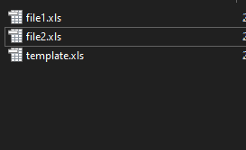

Inside files:

-file1:

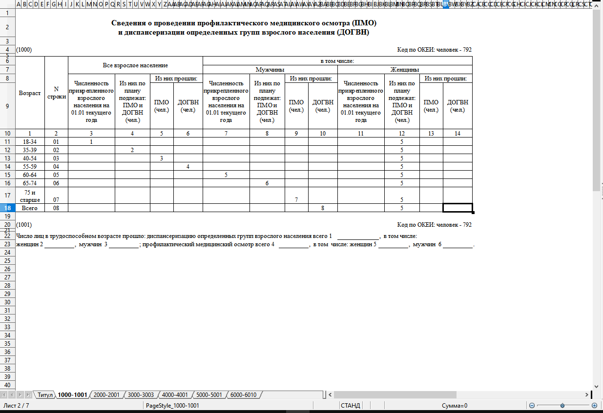

-file2:

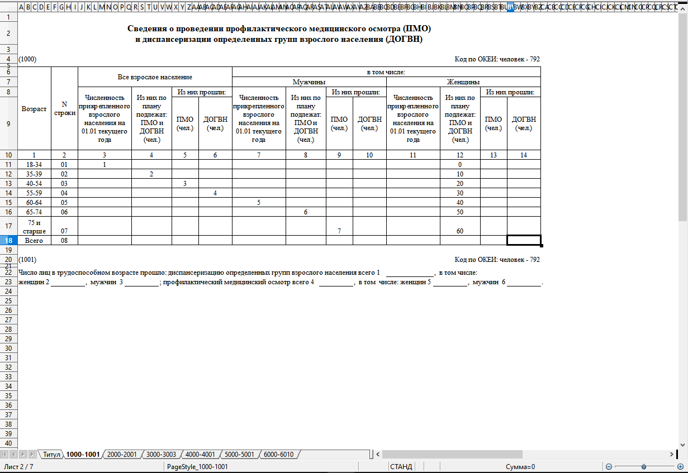

-and template file:

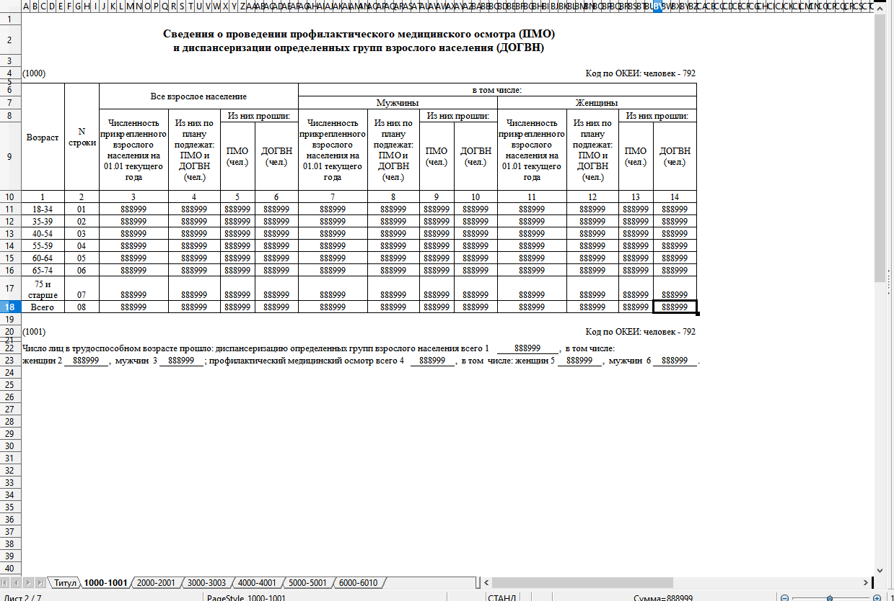

The marker for summation cell having value of target cell: **888999** (very rare case).

So just run programm and choose target directory that should be merged (template.xml or template.xlsx must be in that directory!):

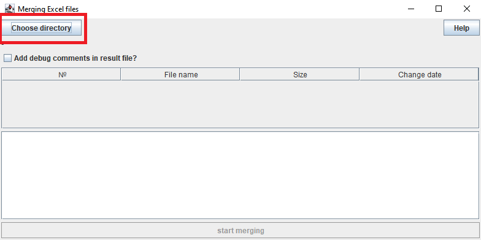

If everifing is ok, you will see view like this:

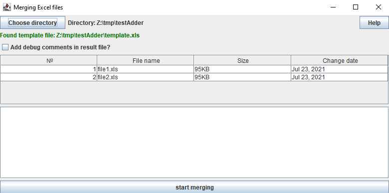

Than just click on lower button "start merging" and than you will see that view:

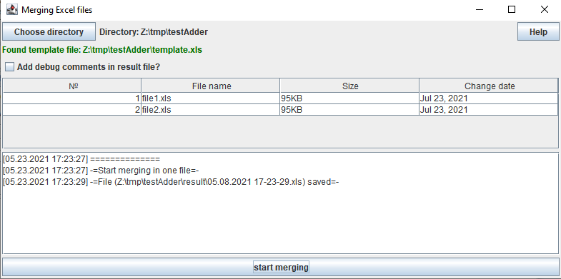

So, that is all that need for merging. If you click on Directory path label (view image):

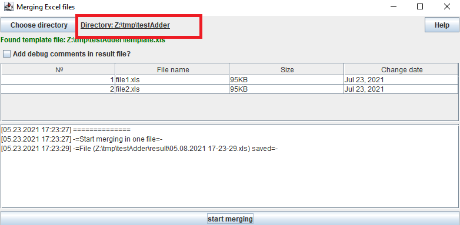

Target directory will be opened via fileExplorer

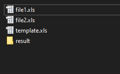

The target file now have one more direcotry named "result". Inside that directory pushing merged files.

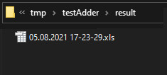

All marked cell are summed:

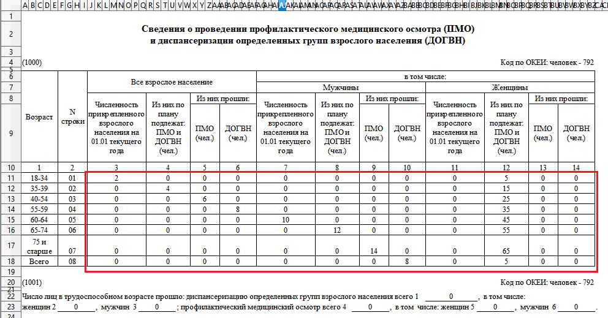

# Dubugger mode

If need to know more information about sum in resulting cells, you can check checkbox "Add dubug comments in result file?" like in screenshot:

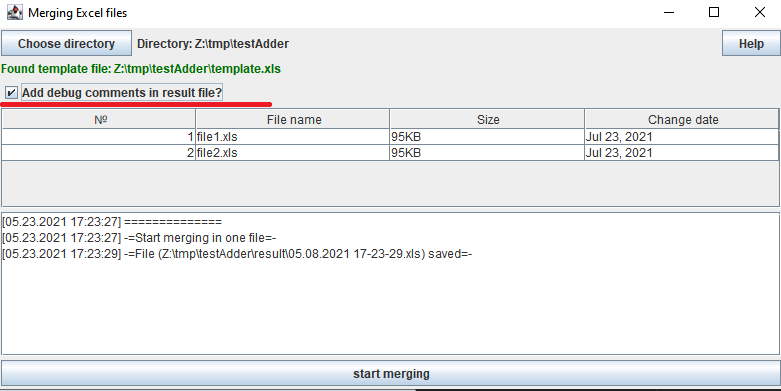

Pay attention that result file having different type of name:

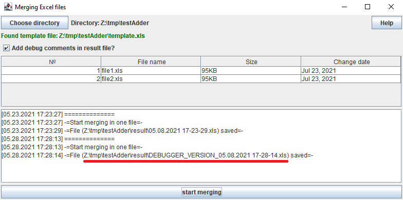

Now result file have marking via yellow color background cells. And if your hover top right corner of result cell, your will able to view addition information about result (namefile - source value):

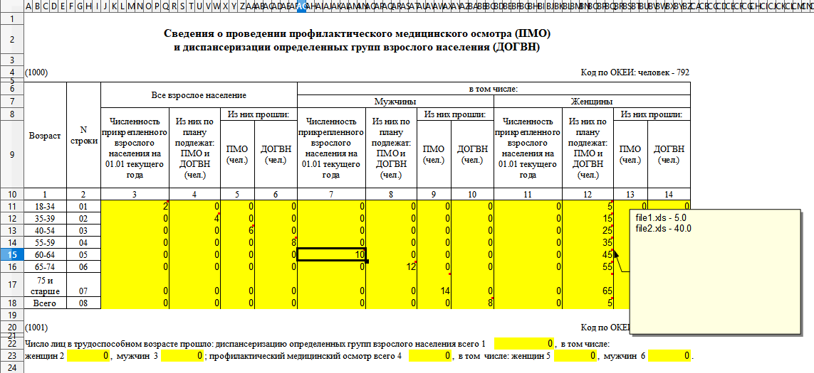

# P.S.

Please be free to create issue in debug tracker. Or let me know about your results. Thanks!